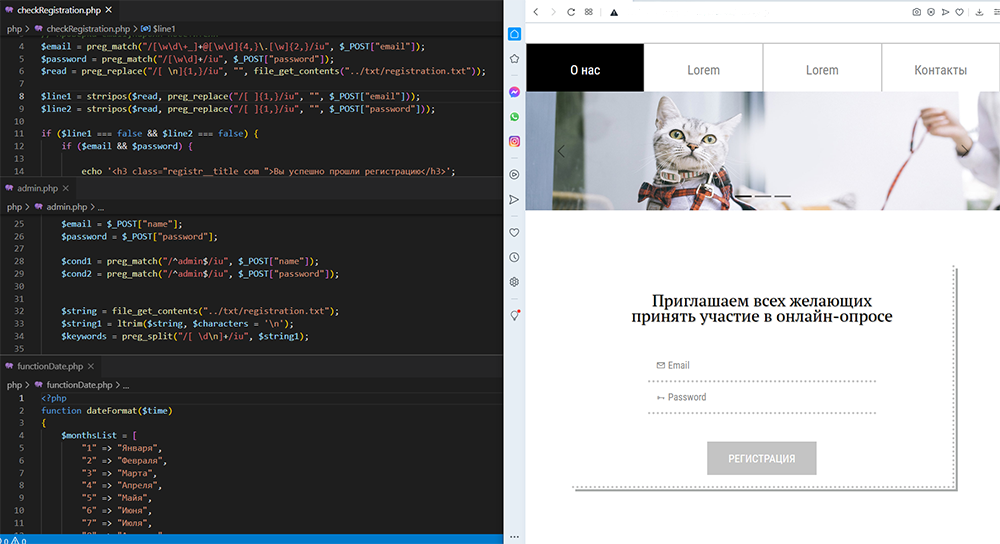

# Questionnaire survey
 

---

##Что такое "Анкетный опрос"?

**Анкетный опрос** - это проект, который позволяет создавать и анализировать опросы в Интернете.  Собранная информация  автоматически записывается в электронную таблицу, которую можно посмотреть под правами администратора.

### Как использовать этот репозиторий
1. Клонируйте репозиторий с github
2. Разместите папку с репозиторием на веб-сервере
3. Зайти под правами администратора на веб-странице:
   + Имя: admin
   + Пароль: admin

### Создано с помощью:
* `HTML`
* `CSS`
* `PHP`
* `Bootstrap - используемый веб-фреймворк `
* `CDNJS  - библиотека font-awesome @5.15.3`
* `Google Fonts - библиотека шрифтов `
---
## Автор
* Лунёва Анна
---
 _☝ Обратите внимание, что этот проект предназначен для использования только в учебных целях._

